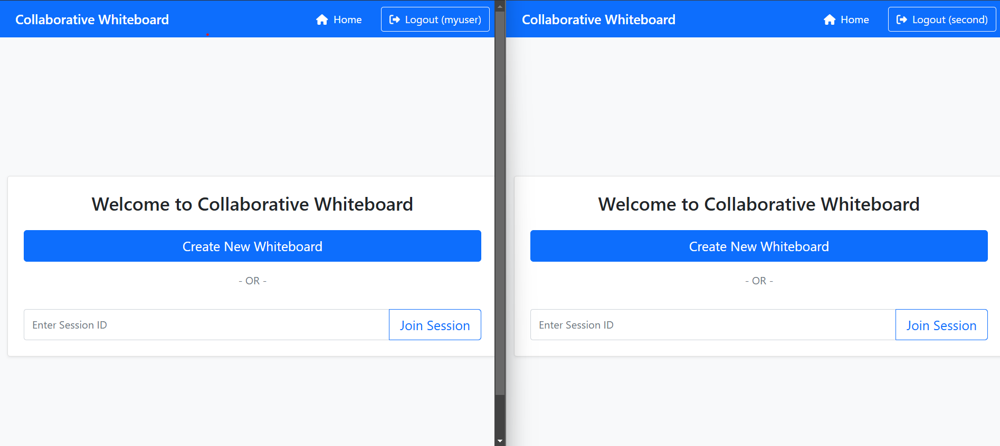
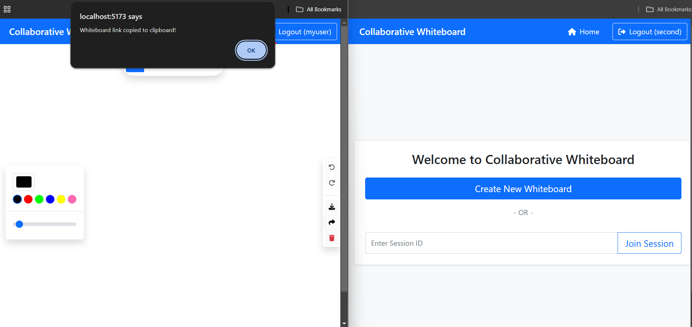
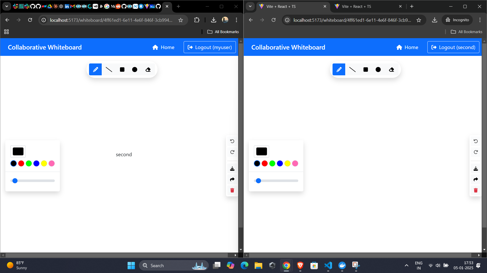
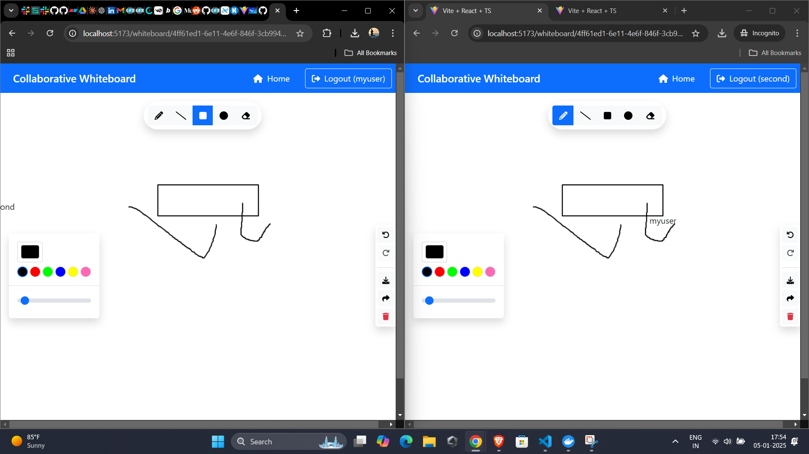

# Collaborative Whiteboard Application

## Overview

A real-time collaborative whiteboard application where multiple users can draw, sketch, and collaborate simultaneously.
Features include real-time cursor tracking, various drawing tools, and session sharing capabilities.

## Technologies Used

### Frontend

- React 18+ with TypeScript
- Bootstrap 5.0 for styling
- Socket.io-client for real-time communication
- Rough.js for drawing capabilities
- Font Awesome for icons
- UUID for generating unique session IDs

### Backend

- Node.js with Express
- Socket.io for WebSocket implementation
- CORS for handling cross-origin requests

### Authentication

- Keycloak for user authentication and management

### Development Tools

- Vite for frontend build tool
- Docker for containerization
- TypeScript for type safety

## Features

- Real-time collaborative drawing
- Multiple drawing tools (pencil, line, rectangle, circle, eraser)
- Color picker and stroke width control
- Undo/Redo functionality
- Save canvas as image
- Share session with others
- Real-time cursor tracking
- User authentication using keycloak

## Installation and Setup

1. Prerequisites:
   ```bash
   - Node.js 14+ installed
   - Docker installed
   - npm or yarn package manager
   ```

## Demo Video

<iframe width="560" height="315"
    src="https://youtu.be/j4xtcguOfT8"
    title="YouTube video player"
    frameborder="0"
    allow="accelerometer; autoplay; clipboard-write; encrypted-media; gyroscope; picture-in-picture"
    allowfullscreen>
</iframe>

## Screenshots

### Whiteboard on two devices



### Link copied to share



### Cursor Tracking



### Drawing tracking



## Thank you
